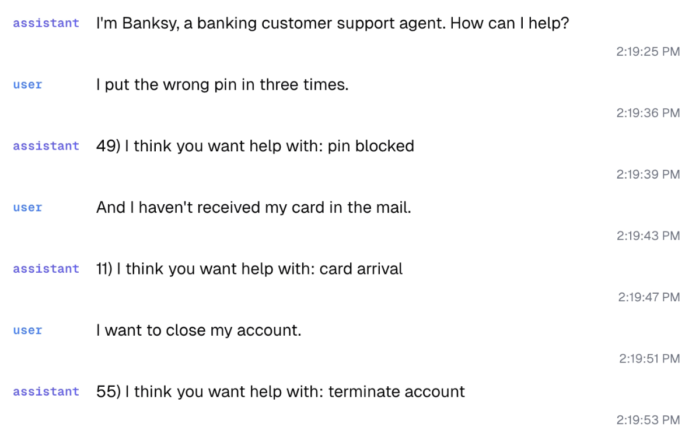

# Hack with Oumi: SLMs for Voice Agents

This repo contains Oumi’s problem statement and starter template for:

* [Nebius.Build SF](https://nebius.com/events/nebius-build-sf), March 15, 2026  
* [Eclipse 6.0](https://eclipse.acmthapar.in/), April 4-5, 2026

## Problem Statement

The theme for [Oumi](https://github.com/oumi-ai/oumi)’s hackathon track is **Small Language Models (SLMs) for Voice Agents.**

A **Voice Agent** differs from a standard AI agent in that users interact with it through spoken conversation. Instead of typing prompts, users speak to the agent and it responds with synthesized speech.

A typical Voice Agent pipeline works as follows:

1. Audio is captured from the user’s microphone.  
2. A **speech-to-text (STT)** model transcribes the audio into text.  
3. The text is processed by an AI agent powered by a language model.  
4. The agent’s response is converted back into audio using a **text-to-speech (TTS)** model and played to the user.

Voice Agents are commonly used in real-time applications such as automated telephone customer support.

In this hackathon, **Small Language Models (SLMs)** are defined as language models with fewer than \~10 billion parameters. Compared to large models, SLMs are significantly cheaper to run and can often operate efficiently on consumer-grade edge devices. When fine-tuned for specific tasks, SLMs can even outperform much larger models such as GPT-5.4 or Claude Opus 4.6.

Voice Agents have strict **latency requirements** because they operate in real time. Delays in transcription, reasoning, or speech synthesis can significantly degrade the conversational experience. Because SLMs are smaller and faster to run, they can reduce response times and improve overall responsiveness. In many cases, an architecture composed of **multiple specialized SLMs working together** may achieve lower latency and better performance than a single large general-purpose model.

### **The Challenge**

Your task in this hackathon is to build a **Voice Agent where one or more fine-tuned SLMs play a central role**.

Requirements:

* You **must use [Oumi](https://github.com/oumi-ai/oumi)** to fine-tune the models in your solution and 🌟 **star the [Oumi GitHub repo](https://github.com/oumi-ai/oumi)** 🌟.  
* There are **no restrictions on the application domain**, but the agent should address a **specific, realistic use case**.  
* There is **no need to justify the use of SLMs with evaluations**, although the latency benefits should be clear  
* There is **no requirement to use open-weight models**, although this is highly encouraged.

Submissions will be evaluated based on:

* **Creativity**  
* **Real-world impact**  
* **Technical quality**

## Agent Submodels

Here are some suggestions for how you can modularize an agent into task specific models, each of which could be implemented as a fine-tuned SLM:

* Guardrails and LLM-Judges (are my inputs and outputs valid, safe, and relevant?)  
* Query rewriting (how could this query be rewritten for more effective knowledge retrieval?)  
* Execution routing (which step in the workflow should I take next given the user query?)  
* Retrieval routing (which of my data sources \- vector/graph database(s) etc. \- should I search given the user query?)  
* Model routing (should this query go to the powerful LLM or simpler SLM?)  
* Planner (develop a plan, i.e. multiple steps, to achieve the intended outcome)  
* Verifier (what would happen if we carried out the plan \- is it a good idea?)  
* Executors (convert the plan into a sequence of tool calls)  
* Memory management (are there any relevant facts in the query that would be useful in the future?)

## Starter Template 
We have included a starter template Voice Agent in this repo under [`/template`](https://github.com/oumi-ai/hack-with-oumi/tree/main/template). See the [README](https://github.com/oumi-ai/hack-with-oumi/tree/main/template) there for instruction on how to install and use.

The template is intended to allow participants to focus on the "agent" part of the voice agent and not have to worry about the STT, TTS, and audio pipeline parts. There are no requirements to use this code, although it may help you to build faster.

## Submission Showcase
After judging is complete, we will add interesting submissions to this section.

## Additional Resources

* Blog  
  * [Small Fine-tuned Models are All You Need \- by Stefan Webb](https://blog.oumi.ai/p/small-fine-tuned-models-are-all-you)  
* Oumi Open-Source Stack  
  * [Oumi GitHub](https://github.com/oumi-ai/oumi)  
  * [Quickstart Guide](https://oumi.ai/docs/en/latest/get_started/quickstart.html)  
  * [Training](https://oumi.ai/docs/en/latest/user_guides/train/train.html)  
* Agent frameworks  
  * [Picoagents](https://github.com/victordibia/designing-multiagent-systems)  
  * [Microsoft Agent Framework](https://github.com/microsoft/agent-framework)  
  * [AutoGen](https://github.com/microsoft/autogen)  
* Other libraries  
  * [Pipecat](https://github.com/pipecat-ai/pipecat)  
  * [vLLM](https://github.com/vllm-project/vllm)  
  * [vLLM-MLX](https://github.com/waybarrios/vllm-mlx)  
  * [Ollama](https://github.com/ollama/ollama)  
* Papers  
  * “​​[Small Language Models are the Future of Agentic AI](https://arxiv.org/abs/2506.02153)”  
  * “[Agentic AI Needs a Systems Theory](https://arxiv.org/abs/2503.00237)”
